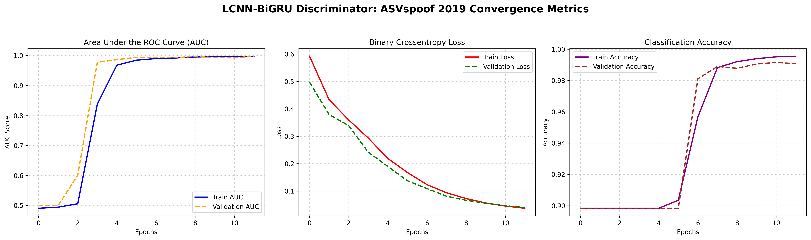
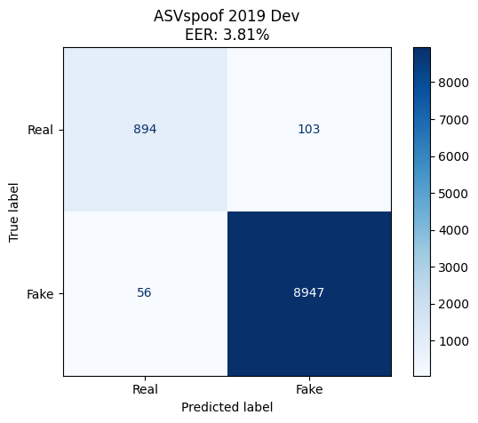
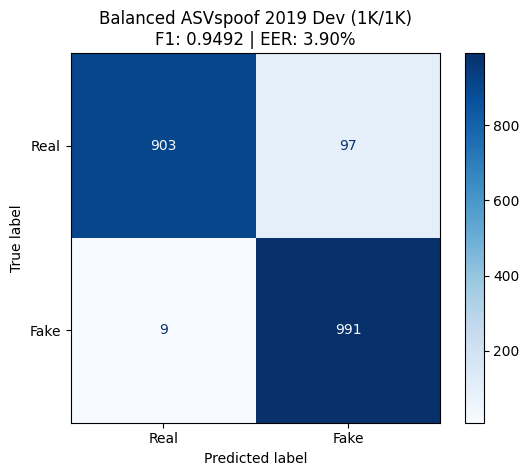
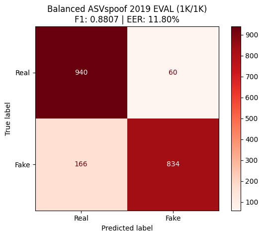
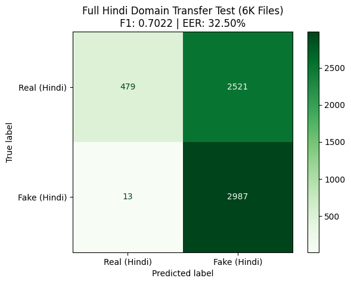
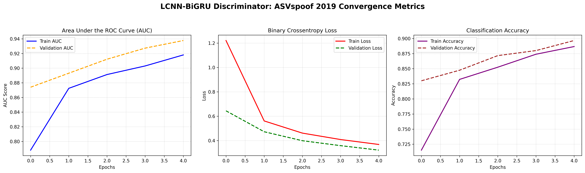
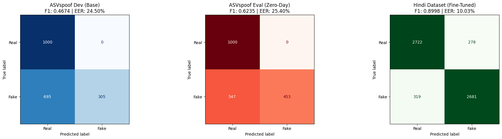

# DeepCheck: Audio Forensics & Deepfake Detection

An advanced machine learning pipeline designed to detect AI-generated synthetic audio, Text-to-Speech (TTS), and Voice Conversion (VC) attacks. This project utilizes a multi-sensory feature fusion approach combined with a mathematically optimized LCNN-BiGRU architecture to detect phase anomalies and vocoder artifacts in human speech.

## 🧠 Core Architecture
* **Feature Fusion:** Extracts and fuses Linear Frequency Cepstral Coefficients (LFCC), Bark Frequency Cepstral Coefficients (BFCC), and Modified Group Delay (MGD) with Bark-band pitch filtering.
* **LCNN (Light CNN):** Utilizes Max-Feature-Map (MFM) activations to aggressively reduce dimensionality while filtering out irrelevant acoustic noise.
* **BiGRU & Attention:** A Bidirectional GRU paired with an explicit, temporally-aligned Softmax attention mechanism to mathematically isolate high-frequency deepfake glitches.
* **Global Adaptability:** While tested on English and Hindi, this feature-extraction pipeline and neural architecture is fundamentally language-agnostic and can be fine-tuned to protect telecommunication networks in **any language**.

---

## 📊 Datasets

1. **ASVspoof 2019 (Logical Access):** The global standard academic dataset for detecting logical access spoofing attacks. Used to train the base model on core vocoder artifacts.
2. **Custom Hindi Telecom Dataset (6,000 Files):** A proprietary dataset built to test real-world, cross-lingual domain adaptation on degraded telecommunication networks.
   * **3,000 Real Files:** Sourced from **Mozilla Common Voice** and **AI4Bharat**.
   * **3,000 Fake Files:** AI-generated deepfakes created using **EdgeTTS**, **Facebook TTS**, and **gTTS**.

---

## 🛠️ Project Evolution & Model Versions

### 📉 Model 1.0: The Overfitting Trap
Early iterations of this model encountered severe dataset imbalance issues. Because deepfake datasets often contain vastly more "Fake" audio than "Real" audio, Model 1.0 fell into the Memorization Trap. It achieved superficially high accuracy by overfitting to the training data, but failed to generalize. This hurdle led to the implementation of strictly balanced 1K/1K evaluation protocols and Max-Feature-Map (MFM) dimensionality reduction to force the AI to learn *concepts* rather than memorize files.

---

### 🏆 Model 2.0: The ASVspoof Champion
This baseline model was trained exclusively on pristine English ASVspoof 2019 data. 

**Model 2.0 Training History**

**Phase 1: Known Attacks (Dev Set)**
The model proved incredibly capable of identifying deepfake algorithms it was trained on.
* **Dev Set (10,000 Files):**
  
* **Dev Set (Balanced 1K/1K Benchmark):**
  

**Phase 2: Zero-Day Attacks (Eval Set)**
Tested against completely unknown TTS/VC algorithms to evaluate true zero-day threat generalization.
* **Eval Set (Balanced 1K/1K Benchmark):**
  

**Phase 3: The Domain Gap Baseline**
When tested blindly against the custom Hindi dataset, the pristine English model suffered a massive domain shift, achieving an EER of over 30% due to its unfamiliarity with Indian telecommunication background noise and phonetic structures.
* **Hindi Baseline (Zero Fine-Tuning):**
  

---

### 🌐 Model 2.1h: Hindi Telecom Adaptation & Catastrophic Forgetting
To bridge the Domain Gap, we utilized Transfer Learning to fine-tune the Model 2.0 architecture directly on the Hindi dataset using a microscopic learning rate.

**Model 2.1h Fine-Tuning History**

**The Grand Evaluation: Success & Compromise**
The fine-tuning successfully dropped the Hindi dataset EER to an impressive **10.03%** (F1: 0.8998), proving the model can be successfully adapted to new languages and noisy network conditions.

However, as visualized below, the model suffered from **Catastrophic Forgetting**. To accommodate the noisy Hindi audio, the network shifted its mathematical decision boundaries, which subsequently degraded its performance on the original English ASVspoof files (Dev EER spiked to 24.50%). 

> **🔬 Future Work:** Future production deployments will resolve this forgetting phenomenon by implementing **Experience Replay**—training the model on interleaved batches of both the target domain (Hindi) and the base domain (English) simultaneously to maintain a globally robust brain.

---

## 🚀 Usage & Deployment
1. Clone the repository and install requirements.
2. Ensure datasets are placed in the `la/` and `training_data/` directories.
3. Run the feature extraction and cache generation blocks in the Jupyter Notebook.
4. Execute the LCNN-BiGRU training sequence.

*Note: Raw gigabyte audio datasets and `.npy` feature caches are excluded from this repository via `.gitignore` due to file size constraints. The optimized `.keras` model weights are included for immediate testing.*